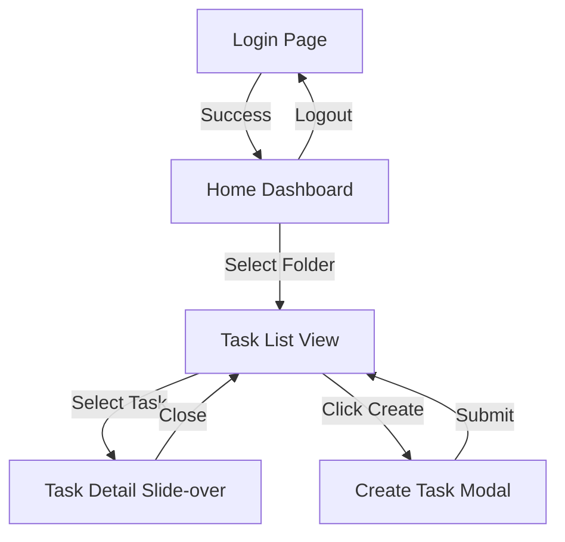
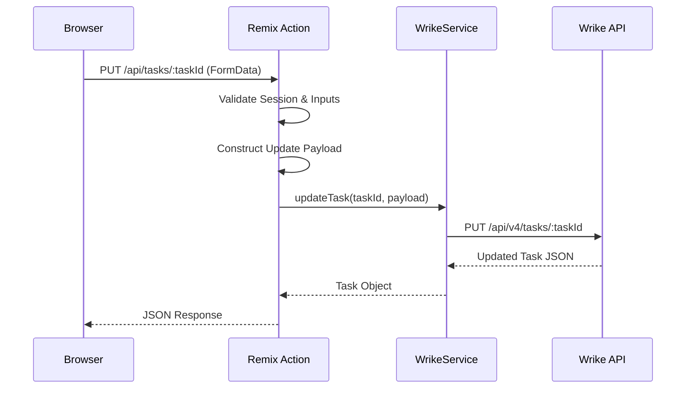

# Wrike WebApp Refactoring Design Document

## 1. Introduction
This document outlines the detailed design for refactoring the existing `wrike-webapp`. The goal is to improve code maintainability, scalability, and user experience based on an analysis of the current codebase.

## 2. Frontend Design (Screen Design)

### 2.1. Screen Layout
The application follows a classic "Dashboard" layout consisting of three main areas:

1.  **Header (Top Bar)**
    *   **Left:** Mobile Menu Toggle (Hamburger), App Title ("Wrike Dashboard"), User Greeting.
    *   **Right:** Logout Button.
    *   **Center (Contextual):** View Switcher (Table/Board/Gantt) - visible only when a folder is selected.

2.  **Sidebar (Left Navigation)**
    *   **Content:** Hierarchical tree view of Spaces and Folders/Projects.
    *   **Behavior:** Collapsible on mobile (off-canvas), fixed width on desktop.
    *   **Interactions:** Expand/Collapse Spaces, Select Folder/Project.

3.  **Main Content Area**
    *   **Empty State:** Prompt to select a folder.
    *   **Task List View:** Displays tasks in the selected view mode (Table, Board, Gantt).
    *   **Task Detail Slide-over:** Overlays the right side of the screen when a task is selected.

### 2.2. Screen Transition Diagram

### 2.3. Screen Item Definitions

#### 2.3.1. Create Task Modal
| Item Name | Type | Required | Default | Constraints | Description |
| :--- | :--- | :---: | :--- | :--- | :--- |
| Title | Text Input | Yes | - | Non-empty | Task title. |
| Importance | Select | Yes | Normal | High, Normal, Low | Priority level. |
| Status | Select | No | Default | Workflow dependent | Initial status. |
| Assignees | Checkbox List | No | - | - | Users responsible for the task. |
| Start Date | Date Picker | No | - | - | Planned start date. |
| Due Date | Date Picker | No | - | >= Start Date | Planned due date. |
| Description | Text Area | No | - | - | Detailed description. |

#### 2.3.2. Task Detail View
| Item Name | Type | Required | Editable | Description |
| :--- | :--- | :---: | :---: | :--- |
| Title | Text Input | Yes | Yes | Click to edit, Enter/Check to save. |
| Permalink | Link | - | No | Link to open task in Wrike. |
| Importance | Select | Yes | Yes | Updates immediately on change. |
| Assignees | Checkbox List | No | Yes | Updates immediately on change. |
| Dates | Date Pickers | No | Yes | Start and Due dates. |
| Status | Select | Yes | Yes | Updates immediately. Shows Workflow name. |
| Description | Text Area | No | Yes | Click to edit, Save/Cancel buttons. |
| Custom Fields | Dynamic | No | Yes | Renders based on field type (Text, Numeric, DropDown). |
| Attachments | List/Upload | No | Yes | View list and upload new files. |

### 2.4. Display Logic & Controls
*   **Sidebar:** Folders are lazily loaded when a Space is expanded. Loading spinners indicate active fetching.
*   **Task List:**
    *   **Filtering:** Client-side filtering by Search Text, Status, and Importance.
    *   **Bulk Actions:** Visible only when one or more tasks are selected.
*   **Task Detail:**
    *   **Optimistic UI:** Changes are reflected immediately while the background request processes.
    *   **Loading State:** Full-screen (or container) loader while fetching task details.

## 3. Backend Design (Functional & Logic)

### 3.1. Function List
*   **Authentication:** Session-based auth using Wrike API tokens.
*   **Space/Folder Navigation:** Fetching hierarchy from Wrike.
*   **Task Management:** Listing, Creating, Updating tasks.
*   **Attachment Management:** Listing and Uploading files.
*   **Master Data:** Fetching Users (Contacts), Workflows, Custom Fields.

### 3.2. Processing Flow (Task Update)

### 3.3. Error Handling
*   **Global Error Boundary:** Catches unhandled exceptions (e.g., 500 errors) and displays a user-friendly error page.
*   **API Errors:** `WrikeService` intercepts Axios errors and normalizes them.
    *   **401 Unauthorized:** Redirects to `/login`.
    *   **403 Forbidden:** Displays permission error.
    *   **404 Not Found:** Displays "Resource not found".
    *   **Validation Errors:** Returned as JSON to be displayed in the UI (e.g., Toast or Form Error).

## 4. Data Design

### 4.1. Data Models (Wrike Mapping)
Since the application uses Wrike as the backend, the "Database Design" corresponds to the Wrike Data Model mapping.

| Entity | Wrike API Resource | Key Fields | Notes |
| :--- | :--- | :--- | :--- |
| **Space** | `/spaces` | `id`, `title`, `accessType` | Top-level container. |
| **Folder** | `/folders` | `id`, `title`, `childIds`, `project` | Can be a Folder or a Project. |
| **Task** | `/tasks` | `id`, `title`, `status`, `importance`, `dates` | Core entity. |
| **User** | `/contacts` | `id`, `firstName`, `lastName`, `type` | Assignees. |
| **Workflow** | `/workflows` | `id`, `name`, `customStatuses` | Defines available statuses. |
| **CustomField** | `/customfields` | `id`, `title`, `type`, `settings` | User-defined fields. |

### 4.2. State Management Strategy
*   **Server State:** Managed by React Router `loader` and `action`. This is the "source of truth".
*   **Client Cache:** React Router handles caching of loader data. `useFetcher` is used to mutate data and revalidate loaders.
*   **Local State:** `useState` is used for:
    *   UI state (Sidebar open/close, Modal visibility).
    *   Form input state (before submission).
    *   Optimistic updates (temporary display before server confirmation).

## 5. Interface Design

### 5.1. Internal API Specification (Remix Routes)
These are the endpoints exposed by the Node.js server to the React client.

| Method | Endpoint | Description | Parameters |
| :--- | :--- | :--- | :--- |
| `GET` | `/api/spaces/:spaceId/folders` | Get folders in space | `spaceId` |
| `GET` | `/api/folders/:folderId/tasks` | Get tasks in folder | `folderId` |
| `POST` | `/api/folders/:folderId/tasks` | Create task | `folderId`, `title`, `status`, etc. |
| `GET` | `/api/tasks/:taskId` | Get task details | `taskId` |
| `PUT` | `/api/tasks/:taskId` | Update task | `taskId`, `title`, `status`, etc. |
| `GET` | `/api/contacts` | Get all contacts | - |
| `GET` | `/api/tasks/:taskId/attachments` | Get attachments | `taskId` |
| `POST` | `/api/tasks/:taskId/attachments` | Upload attachment | `taskId`, `file` |

### 5.2. External System Integration (Wrike API)
*   **Base URL:** `https://www.wrike.com/api/v4`
*   **Authentication:** Bearer Token (passed from client session).
*   **Rate Limiting:** Handled by Wrike API. The application should handle 429 responses (currently basic retry/error).
*   **Data Format:** JSON.

## 6. Refactoring Plan (Phased)

### Phase 1: Component Architecture
*   **Goal:** Decompose monolithic components (`TaskList`, `TaskDetail`).
*   **Actions:**
    *   Create `components/ui` (Button, Input, etc.).
    *   Extract `TaskItem`, `TaskFilters`, `TaskAssigneeSelector`.

### Phase 2: Logic & Hooks
*   **Goal:** Separate logic from presentation.
*   **Actions:**
    *   Implement `useTasks`, `useTask`, `useTaskMutation` hooks.
    *   Centralize API calls in hooks/services.

### Phase 3: Advanced Features
*   **Goal:** Improve UX.
*   **Actions:**
    *   Implement Toast notifications.
    *   Add Skeleton loading screens.
    *   Implement virtual scrolling for large task lists (if needed).
